<b>
Universidad San Carlos de Guatemala 
Escuela de Ingeniería en Ciencias y Sistemas 
Facultad de Ingeniería 
Sistemas Operativos 1  
</b>

<h1 style="margin-bottom: 0; border-bottom: none; text-decoration: underline;">Proyecto 1: Manual técnico </h1>
202111478 - José David Panaza Batres

 

<b>Resumen</b>  

Este proyecto tiene como objetivo principal la implementación de un sistema integral de monitoreo de recursos del sistema y gestión de procesos. Para lograr esto, se utilizarán diversas tecnologías y lenguajes de programación. El resultado final será un sistema que proporcionará información vital sobre el rendimiento del computador, los procesos en ejecución y su administración, todo ello a través de una interfaz de usuario intuitiva y amigable.

Para alcanzar este objetivo, se empleará Docker Compose. Dockerizará tanto el frontend desarrollado con React como el backend implementado con Go, aprovechando las funcionalidades de las goroutines de Go para una gestión eficiente de procesos. Además, se utilizará una imagen de Docker de MySQL, obtenida desde Docker Hub, para gestionar la base de datos.

Una vez que cada componente esté dockerizado y funcional de manera individual, se procederá a integrar todo en un entorno de desarrollo unificado. Todo el sistema será dockerizado en su conjunto y las imágenes resultantes serán subidas a Docker Hub. Posteriormente, se desplegará el sistema en una máquina virtual con Ubuntu Server. Se expondrá el puerto 80 para el frontend, permitiendo así acceder al sistema desde cualquier máquina en la red.

<b>Palabras clave</b>  
Monitoreo, Recursos, Sistema, Proceso, Tecnologias, Docker, MySQL, Despliegue.

<b>Summary</b>

This project aims to implement a comprehensive system for monitoring system resources and managing processes. To achieve this, various technologies and programming languages will be used. The final result will be a system that provides vital information about computer performance, running processes, and their management, all through an intuitive and user-friendly interface.

To accomplish this goal, Docker Compose will be employed. It will dockerize both the frontend developed with React and the backend implemented with Go, leveraging Go's goroutines functionalities for efficient process management. Additionally, a Docker image of MySQL, obtained from Docker Hub, will be used to manage the database.

Once each component is dockerized and functioning individually, everything will be integrated into a unified development environment. The entire system will be dockerized as a whole, and the resulting images will be uploaded to Docker Hub. Subsequently, the system will be deployed on a virtual machine with Ubuntu Server. Port 80 will be exposed for the frontend, allowing access to the system from any machine on the network.

<b>Keywords</b>  
Monitoring, Resources, System, Process, Technologies, Docker, MySQL, Deployment.

<h3>Web UI</h3>

Para el desarrollo de la interfaz de usuario se utilizó React, la cual es una biblioteca de JavaScript para construir interfaces de usuario. 

Se utilizaron varias dependecias para desarrollar el frontend, así como librerías para graficar. Se utilizó router para tener varias páginas en un header y así poder navegar entre varios entornos. A continuación se enlistaran todas las librerias que se utilizaron en el proyecto:

1. Bootstrap (^5.3.2)
2. Chart.js (^4.4.1)
3. React (^18.2.0)
4. React Bootstrap (^2.10.1)
5. React Icons (^5.0.1)
6. React Router Dom (^6.22.0)
7. React Toastify (^10.0.4)
8. Vis-Data (^7.1.9) y Vis-Network (^9.1.9)

El frontend esta compuesto de 1 enrutador, 3 paginas principales y 8 componentes. El enrutador utiliza Router Dom y aqui se especifican los endpoints y las paginas que debe llamar con los endpoints. Las 3 paginas principales son:

**Monitor:**

Aqui se obtiene un monitor del sistema, el cual mide el porcentaje de ram y de cpu utilizado a través de nuestros módulos. En la parte superior se encuentran 2 graficas de pie, las cuales muestran en tiempo real (cada 500ms) como va cambiando el porcentaje de uso. Esto se consulta a la API con el endpoint /monitor.

En la parte inferior se encuentra una grafica lineal, la cual grafica de manera historica lo que se ve en las graficas de arriba, esto se logra con la base de datos. Esta aplica un modelo curvo sobre los puntos y al igual que lo de arriba, se ejecuta cada 500ms. Las dos gráficas fueron creadas a través de Chart.js.

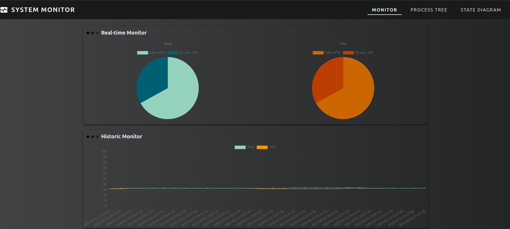

**Process Tree:**

Aqui se obtienen los procesos que está ejecutando el CPU, hay una lista con los PID que se actualiza cada segundo y al seleccionar una opción, se muestra un diagrama de árbol hecho con la libreria de visjs donde se pueden ver los primeros hijos de los procesos padre, estos procesos se consultan a traves del endpoint /statediagram. 

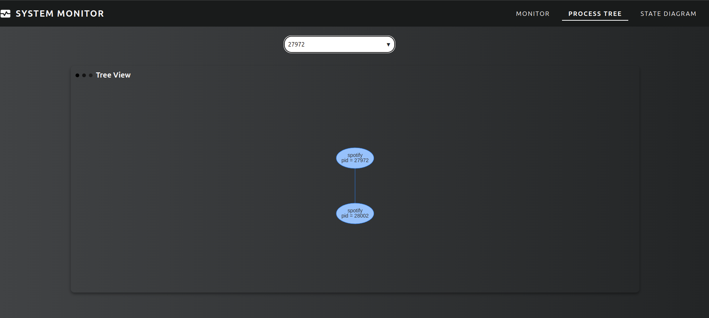

**State Diagram:**

En esta página se observa una simulación gráfica hecha con visjs de como trabaja un proceso, al seleccionar el icono de + se crea un nuevo proceso a través de nuestra API, y al lado se encuentran 3 botones más, los cuales tiene íconos correspondientes a parar, reanudar y matar.

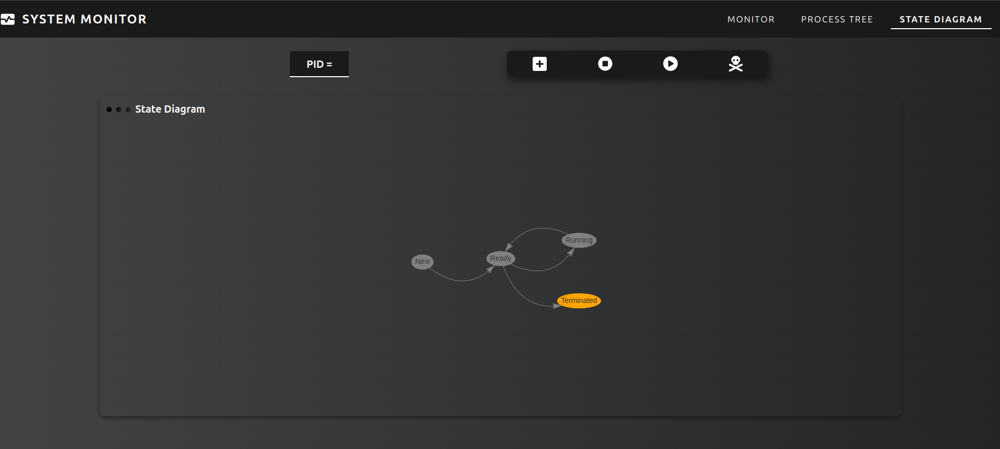

<h3> Nginx </h3>

Como requisito mínimo del proyecto era desplegar el frontend en el puerto 80, para realizar esto se decidió utilizar Nginx.  Nginx es un servidor web de código abierto, altamente eficiente y ligero, así como un servidor proxy inverso y un gestor de servidores HTTP. Originalmente fue creado para resolver los problemas de concurrencia y alto rendimiento asociados con los servidores Apache HTTP Server.

Algunas características clave de Nginx son:

1. Alto rendimiento
2. Balanceo de carga
3. Proxy inverso
4. Servidor HTTP

<h3>Base de Datos</h3>

MySQL se utiliza como el sistema de gestión de bases de datos para almacenar y administrar datos relacionados con el sistema. Se utiliza una imagen de Docker de MySQL, que se obtiene de Docker Hub. Esto asegura la consistencia y facilidad de implementación en diferentes entornos. 

Además, para la administración de la base de datos, se incluye Adminer, una herramienta de gestión de bases de datos que permite a los usuarios administrar bases de datos MySQL, PostgreSQL, SQLite, MS SQL, Oracle y otros, a través de una interfaz web simple y fácil de usar.

<h3> Backend </h3>

El backend se realizó con Golang. Se realizó una API con el fin de manejar varios endpoint y poder dar respueta a varias consultas. Se utilizó los servicios de mux, mysql y cors para poder manejar lo que se solicita. 

Existen 3 endpoints, el mismo número que páginas. Esto se realizo de tal manera para poder llevar un mejor orden.

**/api/monitor**

Aqui se llama la función monitor, en dicha funcion se le realiza un cat a los modulos ya instanciados en el directorio /proc. Se inserta la data a la base de datos cada vez que se consulta. Al mismo tiempo se obtienen los ultimos 30 datos para moder manejar el monitoreo historico. Se construye el objeto JSON que se desea mandar y se manda a través de http.ResponseWriter.

**/api/processtree**

En este endpoint se mandan los datos dependiendo de los parametros que tiene la consulta, se manejó con parametros para poder manejar un solo endpoint. Cuando la consulta no trae ningún parametro se obtienen todos los procesos y se manda el PID para enlistarlo en el combobox. Si el query posee pid, este se obtiene a través del módulo y se devuelve las características del proceso.

**/api/statediagram**

En este endpoint se trabajn varios querys, esto debido a que como solo queriamos un endopoint, se decidió parametrizar las acciones en 4:
1. action=start: Aqui se ejecuta el comando sleep infinity para poder crear un proceso a través de go. Se devuelve el Pid
2. action=stop: Se verifica que venga un PID y se ejecuta una señal kill de sigstop para para con el procesos. 
3. action=resume: Se verifica que venga un PID y se ejecuta una señal kill de sigcont para poder reanudar el proceso.
4. action=kill: Se verifica que venga un PID y se ejecuta una señal kill sigkill para poder matar el proceso

<h3> Modulos de Kernel </h3>

Los modulos de kernel se crean a través de codigo en C, estos son la base de las paginas monitor y processtree. Debido a que de estos modulos se obtiene la información del cpu y ram. Se deben instanciar con "sudo insmod cpu_so1_1s2024.ko" y "sudo insmod ram_so1_1s2024" para poder obtener la información del directorio /proc.

1. Módulo CPU

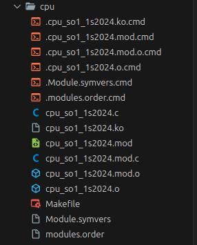

2. Módulo RAM
   
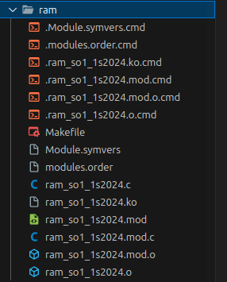

<h3>Dockerizacion</h3>

La dockerización simplifica el proceso de desarrollo y despliegue de aplicaciones al empaquetar cada componente en contenedores independientes. Esto permite ejecutar la aplicación de manera consistente en cualquier entorno. Con Docker Compose, definimos la configuración de los servicios en un archivo YAML, facilitando su gestión y despliegue.

Para nuestra aplicacion se dockerizan los siguientes servicios:

**Database**

Esta es una imagen de docker hub, la cual se llaman sus servicios y se crea un volumen para la persistencia de datos.

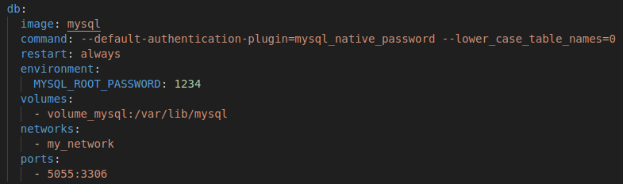

**Adminer**

Es un administrador de base de datos tambien perteneciente al docker hub. Sirve para administrar la base de datos de una manera fácil.

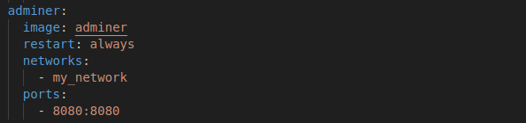

**Backend**

Este por se local se debe crear su dockerfile para empezar y despues se sube al mi dockerhub personal para poder ser bajado sin importar cual sea el dispositivo

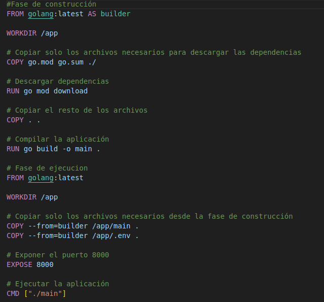

Este se referencia en el docker compose para poder dejar todo en una misma red.

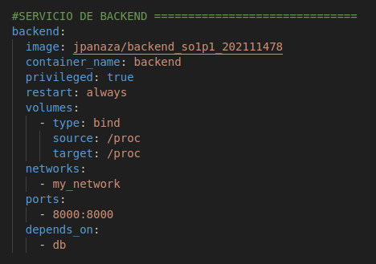

**Frontend**

Este lleva un proceso más complejo debido a que se necesita desplegar en el puerto 80, para esto se utilizó nginx, y se dockerizó de la siguiente manera:

nginx.conf

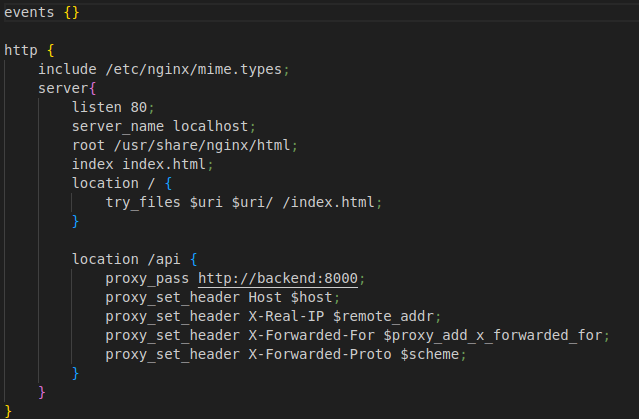

Dockerfile

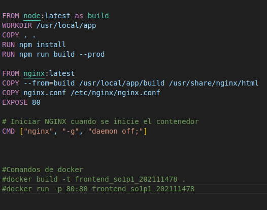

Dockercompose

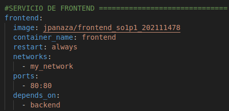

**Servicios Adicionales de docker**

1. network: my_network
2. volumes: volume_mysql

