<b>
Universidad San Carlos de Guatemala 
Escuela de Ingeniería en Ciencias y Sistemas 
Facultad de Ingeniería 
Sistemas Operativos 1  
</b>

<h1 style="margin-bottom: 0; border-bottom: none; text-decoration: underline;">Proyecto 2: Manual técnico </h1>
202111478 - José David Panaza Batres

 

### Introducción

Este proyecto busca implementar un sistema de votaciones para un concurso de bandas de música guatemalteca, utilizando tecnologías modernas y escalables. La arquitectura propuesta se basa en un cluster de Kubernetes para alojar todos los servicios necesarios. Dos rutas principales de carga de datos se establecen: una mediante APIs en Rust que envían información a Kafka, y otra a través de GRPC con aplicaciones en Golang. Un consumidor en Go lee los datos de Kafka y los almacena en MongoDB y Redis. Se desarrollará un frontend en Vue.js para visualizar los registros de MongoDB y Grafana para los datos en Redis. La aplicación Vue.js se ejecutará en Cloud Run, mientras que Grafana estará en el cluster de Kubernetes.

### Objetivos

1. Implementar un sistema de votaciones para un concurso de bandas de música guatemalteca.
2. Utilizar tecnologías modernas y escalables para el desarrollo del sistema.
3. Establecer un cluster de Kubernetes como base para alojar todos los servicios del sistema.
4. Desarrollar dos rutas principales de carga de datos: una mediante APIs en Rust y otra a través de GRPC con aplicaciones en Golang.
5. Integrar un servidor de Kafka para gestionar la comunicación de eventos y mensajes en tiempo real.
6. Crear un consumidor en Go para leer los datos de Kafka y almacenarlos en MongoDB y Redis.
7. Desarrollar un frontend en Vue.js para visualizar los registros de actividad almacenados en MongoDB.
8. Implementar contadores y visualizar los datos almacenados en Redis a través de Grafana.
9. Ejecutar la aplicación Vue.js en Cloud Run para garantizar escalabilidad y disponibilidad.
10. Integrar Grafana en el cluster de Kubernetes para ofrecer una experiencia de usuario coherente.

### Resumen

En este proyecto, se tiene como objetivo principal implementar un sistema de votaciones para un concurso de bandas de música guatemalteca; el propósito de este es enviar tráfico por medio de archivos con votaciones creadas hacia distintos servicios (grpc y wasm) que van a encolar cada uno de los datos enviados, así mismo se tendrán ciertos consumidores a la escucha del sistema de colas para enviar datos a una base de datos en Redis; estos datos se verán en dashboards en tiempo real. También se tiene una base de datos de Mongodb para guardar los logs, los cuales serán consultados por medio de una aplicación web.

### Arquitectura

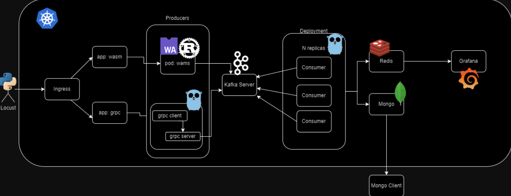

#### Descripción
La arquitectura se basa en tener un cluster de kubernetes, en el cual cuenten todos los servicios a utilizar. Este debe ser capaz de realizar cargas de datos masivas a través de dos rutas, con un ingress. 

La ruta 1 es a través de dos apis de rust, la cual mandará información a el servidor de kafka.

La ruta 2 es a través de GRPC, dos aplicaciones de Golang y estás van a ser capaces de poder mandar mensajes a kafka server.

Despues de tener las dos rutas, debemos enlazar el consumidor hecho en go, Este debe ser capaz de leer todo lo que venga en el topic que creamos de kafka. Y ya leido todo, debe insertar los datos en Mongo y Redis. 

Para poder observar como se van insertando y como va trabajando todo, debemos realizar un frontend en VUE JS. Este consultará los ultimos 20 logs que se realizan en mongo. Para observar lo de redis, ahí se asignarán contadores y estos se consultarán en Grafana. La aplicación de VUE debe ser ejecutada en Cloud Run, y grafana debe estar en el cluster.

### Tecnologías

1. **LOCUST**: Es una herramienta de prueba de carga de código abierto que permite simular usuarios virtuales en un sistema para evaluar su rendimiento y escalabilidad bajo diferentes condiciones de carga.

2. **KUBERNETES**: Es una plataforma de código abierto diseñada para automatizar la implementación, escalado y administración de aplicaciones en contenedores. Proporciona un entorno de ejecución de aplicaciones altamente disponible y distribuido en clústeres de servidores.

3. **GRPC**: Es un framework de comunicación de código abierto desarrollado por Google que permite la comunicación eficiente y rápida entre servicios distribuidos utilizando el protocolo HTTP/2 y la serialización de datos en formato Protocol Buffers.

4. **KAFKA**: Es una plataforma de streaming de código abierto que proporciona una infraestructura escalable y tolerante a fallos para la transmisión y procesamiento de datos en tiempo real.

5. **REDIS**: Es una base de datos en memoria de código abierto que se utiliza comúnmente como almacenamiento en caché, almacén de claves-valor y cola de mensajes. Proporciona alta velocidad y rendimiento para operaciones de lectura y escritura de datos.

6. **MONGO**: MongoDB es una base de datos NoSQL de código abierto, orientada a documentos y altamente escalable. Almacena datos en documentos flexibles similares a JSON, lo que permite una fácil integración y manipulación de datos.

7. **GRAFANA**: Es una plataforma de análisis y visualización de código abierto que permite crear paneles dinámicos y gráficos interactivos para monitorear y analizar datos en tiempo real provenientes de diversas fuentes.

8. **VUE JS**: Es un framework progresivo de código abierto para construir interfaces de usuario interactivas y de una sola página. Permite el desarrollo ágil de aplicaciones web mediante la creación de componentes reutilizables y la gestión eficiente del estado de la aplicación.

9. **CLOUD RUN**: Es un servicio de Google Cloud Platform que permite ejecutar contenedores de manera totalmente administrada y sin servidor. Proporciona escalabilidad automática y gestión de recursos para aplicaciones contenerizadas, lo que simplifica el despliegue y la administración de aplicaciones en la nube.

### DEPLOYMENTS

1. **apirust-deployment**: Este deployment cuenta con dos apis, una que es de client, y otra que es de server. La de client se deploya en el puerto 8000 y la manda al 8080 donde se encuentra el server. Los dos hechos con rust y los contenedores se llaman en el mismo pod.
2. **consumer-deployment**: Este deployment cuenta con el consumer, esta realizado en Golang, y cuenta con un HPA (horizontal pod autoscalling). Se tienen 2 replicas como minimo y 5 como maximo
3. **grafana-deployment**: Este deployment cuenta con la imagen de grafana, la cual se utiliza para ver todos los contadores de redis.
4. **grpc-deployment**: Al igual que con la aplicación de rust, aquí se tienen 2 contenedores en el pod, y estos cuentan con el client y server de Go.
5. **mongo-db**: Aqui se tiene un pod que obtiene la imagen de mongoDB. Este se pone de tipo loadBalancer para poder entrar a la base de datos con la IP.
6. **Kafka pods**: son 4 pods con strimzi para poder utilizar los servicios de kafka.
7. **Redis-db**:  Aqui se tiene un pod que obtiene la imagen de Redis. Este tambien se coloco loadbalancer para utilizarla de manera más fácil.

### SERVICES
Aqui se tiene los servicios para poder comunicar los servicios entre el cluster.
1. **apirust-service**: Servicio tipo clusterIP para comunicar con el deployment de apirust.
2. **grafana-svc**: Servicio para comunicar a través de un portFordwarding a los servicios de grafana, es de tipo ClusterIP
3. **grpc-service**: Servicio tipo clusterIP para comunicar el deployment de grpc.
4. **mongo-svc**: Servicio tipo loadbalancer para comunicar la base de datos de mongo.
5. **redis-svc**: Servicio tipo loadbalancer para comunicar la base de datos de redis.
6. **Kafka svcs**: Son 4 servicios de kafka para poder hacer uso de la herramienta.

### EJEMPLO DE CAPTURAS

1. PODS

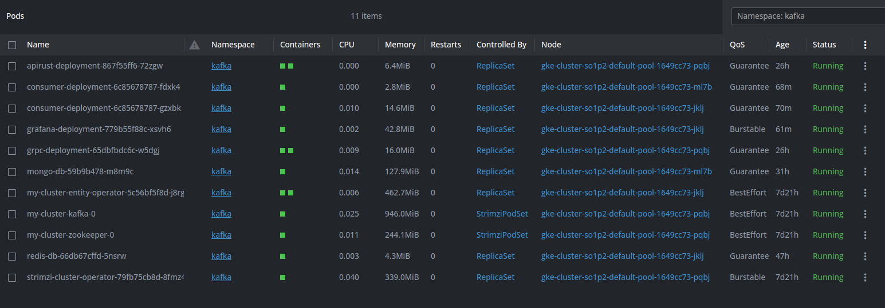

2. SERVICES

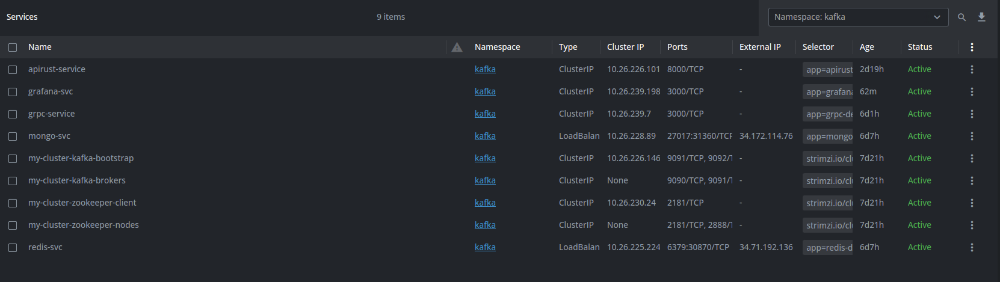

3. INGRESS

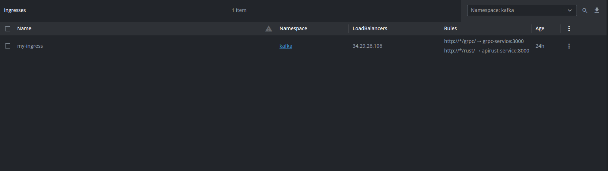

4. LOCUST

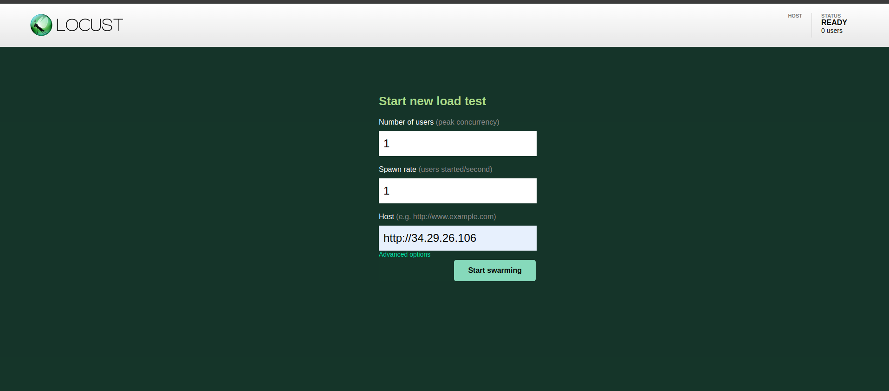

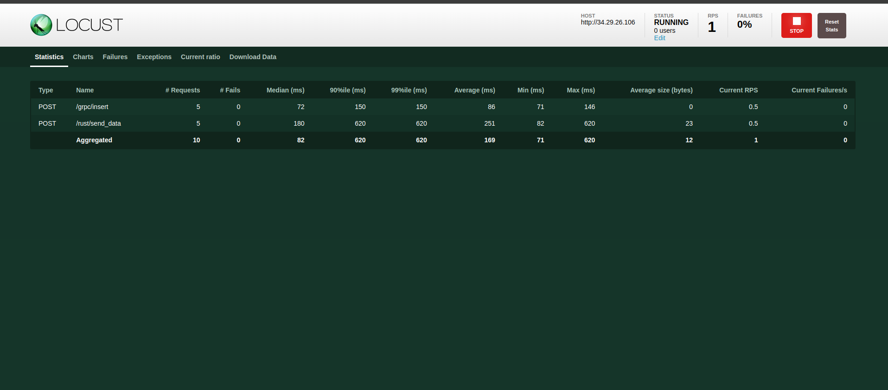

5. LOGS CONSUMER

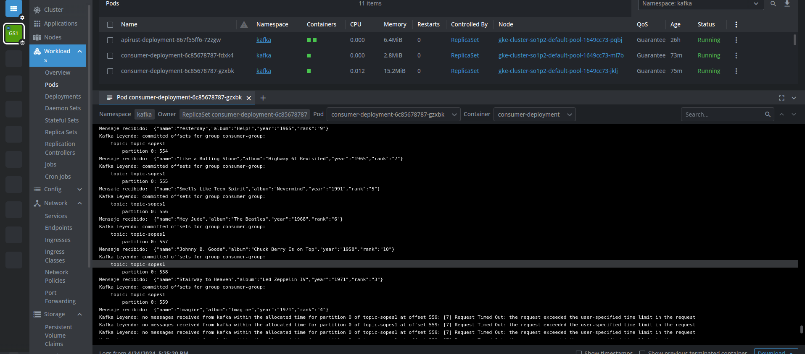

6. MONGO DB

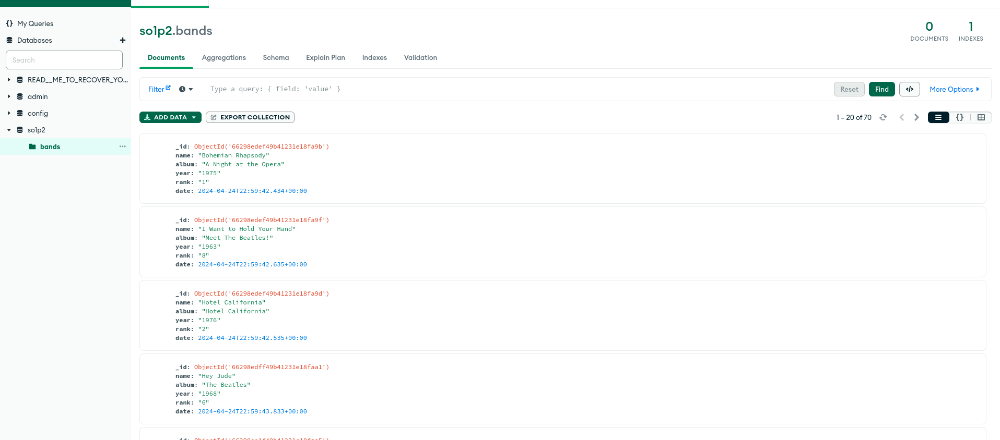

7. REDIS DB

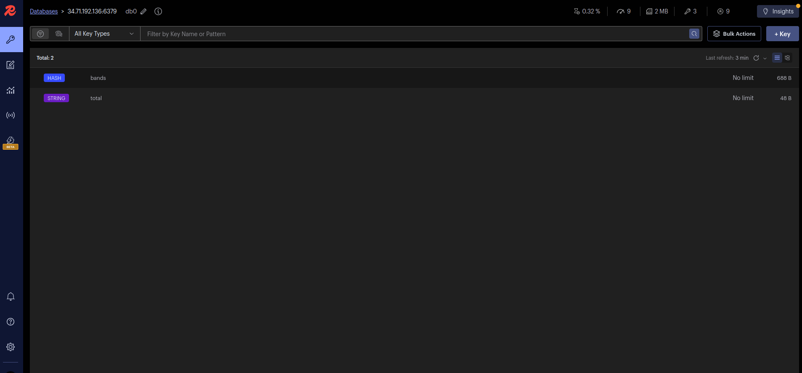

8. VUE JS

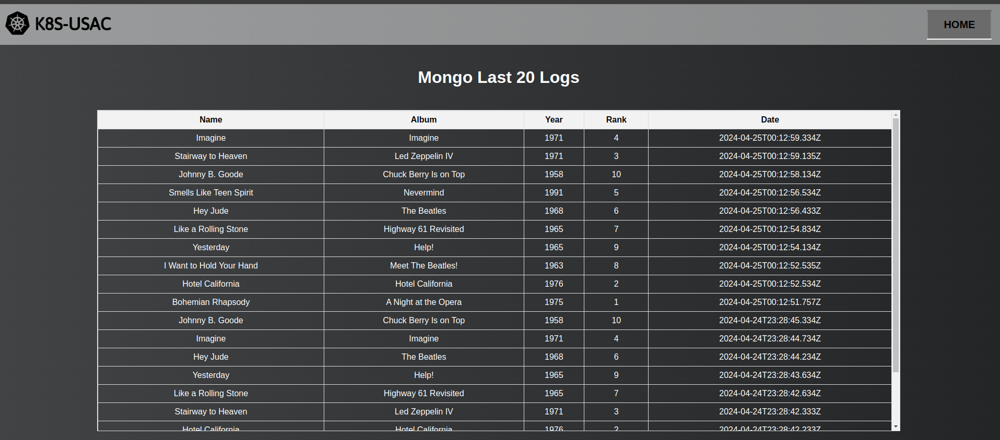

9. GRAFANA

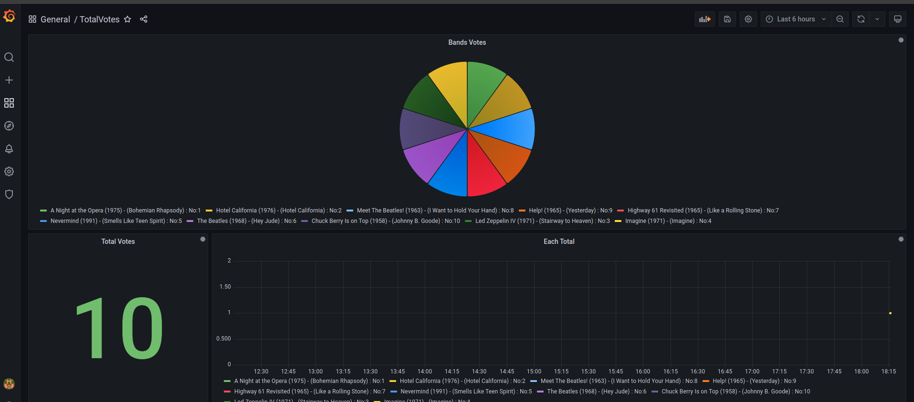

### Conclusiones

Conclusiones:

1. Integración de tecnologías modernas: El proyecto demuestra la capacidad de integrar una variedad de tecnologías modernas y escalables, como Kubernetes, Kafka, GRPC y Redis, para construir un sistema robusto y eficiente para la gestión de votaciones en un concurso de bandas de música guatemalteca. Esta integración permite aprovechar las ventajas individuales de cada tecnología y garantizar un funcionamiento fluido y confiable del sistema en su conjunto.

2. Enfoque en la escalabilidad y el rendimiento: La arquitectura del proyecto está diseñada para ser altamente escalable y tolerante a fallos, lo que permite manejar grandes volúmenes de datos y responder eficientemente a picos de carga durante el proceso de votación. La utilización de servicios como Kubernetes y Cloud Run, junto con tecnologías como Kafka y Redis, proporciona una infraestructura flexible y adaptable que puede crecer según las necesidades del concurso y los usuarios.

3. Experiencia de usuario en tiempo real: El desarrollo de un frontend en Vue.js y la integración con Grafana permiten ofrecer a los usuarios una experiencia visualmente enriquecedora y en tiempo real. Los usuarios pueden monitorear el progreso del concurso, consultar los registros de actividad y visualizar datos estadísticos relevantes de manera intuitiva y accesible. Esto contribuye a mejorar la participación y la satisfacción de los usuarios durante el proceso de votación y promueve una mayor interacción con el concurso de bandas de música guatemalteca.

