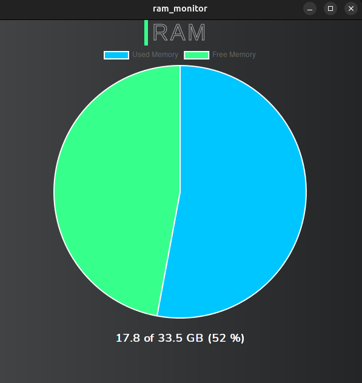

<b>
Jose David Panaza Batres 
202111478 
Sistemas Operativos 1
</b>
<h1>

HOJA DE TRABAJO 1

 
</h1>

El fin de la hoja de trabajo es trabajar con modulos de kernel. Para esto se pidio una aplicación que obtuviera la información del consumo de memoria RAM, y mostrarlo a través de una aplicación de escritorio desarrollada en REACT con WAILS.

<h2>Entregables</h2>
<ul>
    <li>Código fuente: se encuentra en las carpetas el modulo y el proyecto en wails</li>
    <li>Video explicativo: <a href="https://youtu.be/HTVefWC5AYA?si=LM4Fjzs4xIb1bULj"> Hoja de Trabajo 1 202111478 </a> </li>
</ul>

<h2> Capturas de pantalla </h2>

- Aplicacion de escritorio

